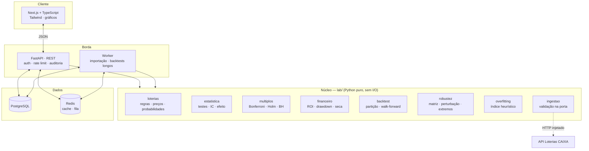
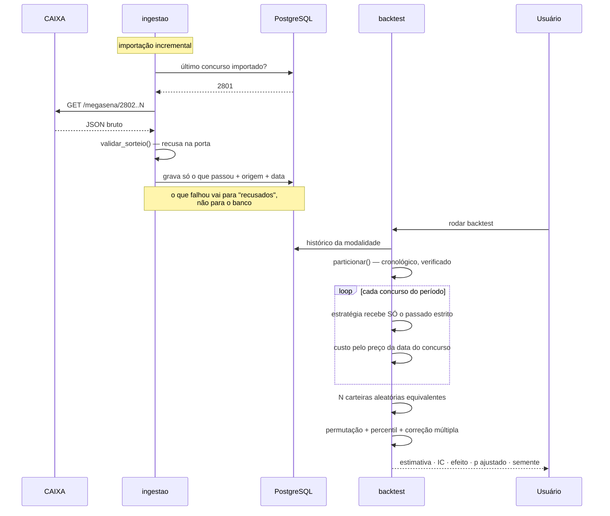
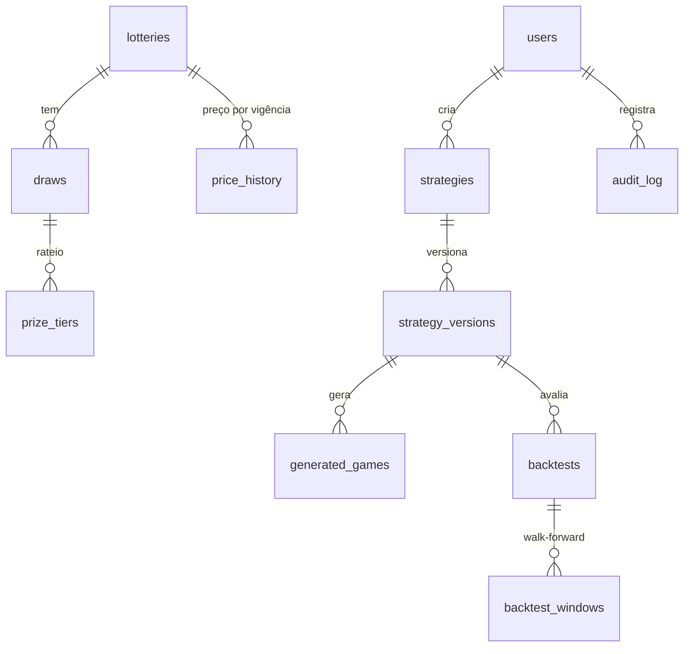
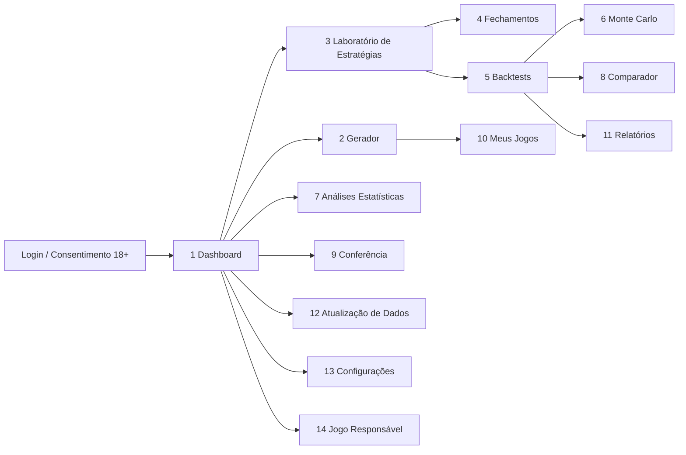

# Arquitetura — Loteria Analytics Brasil

Documento pedido no §33 da especificação, a ser aprovado **antes** do código
completo. Onde um item já existe como código testado, o texto aponta para o
arquivo e para o teste que o prova — o resto é proposta.

---

## 1. Arquitetura proposta

Três camadas, com uma regra de dependência: **o núcleo não conhece nada acima
dele**. `lab/` não importa FastAPI, não importa SQLAlchemy, não abre conexão.
Isso não é purismo — é o que permite rodar 97 testes estatísticos em 1,4 s sem
banco nem rede, e é o que impede que uma mudança de framework quebre a conta de
uma probabilidade.



**Por que worker separado.** Um backtest com 10.000 simulações não cabe num
ciclo de requisição HTTP. A API enfileira, devolve um identificador, e o
cliente acompanha o progresso. Sem isso, o primeiro backtest sério derruba o
servidor por timeout.

**Por que o cliente HTTP é injetado em `ingestao`.** A camada não sabe de onde
vem o JSON. É o que permite testar toda a validação — inclusive respostas
malformadas e fonte fora do ar — sem tocar a rede. Ver `tests/test_ingestao.py`.

---

## 2. Fluxo de dados



O ponto de controle está na validação de entrada: dado ruim que entra no banco
contamina todo backtest daí em diante, e o estrago só aparece meses depois,
como um ROI que ninguém consegue explicar.

---

## 3. Modelo de banco

DDL completo em [`banco/schema.sql`](banco/schema.sql). Resumo e as decisões
que não são óbvias:



| Decisão | Por quê |
|---|---|
| `price_history` como tabela, não coluna | O preço muda com o tempo. Uma coluna única aplicaria o preço de hoje a 2019 e produziria ROI falso. Já implementado em `loterias.Modalidade.preco()`. |
| `strategy_versions` separada de `strategies` | O §10 exige versionamento: qualquer alteração cria nova versão. Backtest aponta para a **versão**, não para a estratégia — senão o resultado deixa de ser rastreável quando alguém edita um filtro. |
| `backtests.seed` obrigatório (`NOT NULL`) | Backtest que não repete não pode ser auditado. O banco recusa a linha sem semente. |
| `backtests` guarda `dev/val/test` como faixas de concurso | Permite reconstituir a partição exata meses depois e reexecutar. |
| `draws.drawn_numbers` como `SMALLINT[]` | Super Sete precisa preservar a **ordem** das colunas; ordenar destruiria o resultado. Array mantém ordem; `UNIQUE(lottery_id, contest_number)` impede duplicidade. |
| `prize_tiers.hits` e não posição na lista | A CAIXA muda a ordem das faixas. Indexar por posição quebra em silêncio. |
| `audit_log` append-only, sem `UPDATE`/`DELETE` | Auditoria que pode ser reescrita não é auditoria. |
| Nenhuma tabela de "número quente/atrasado" | Cache de conceito enganoso vira fonte de verdade. Atraso é calculado sob demanda, sempre com o aviso ao lado. |

---

## 4. Mapa de telas



Duas regras de interface que valem mais que o layout:

**Nenhum número aparece sozinho.** Toda estimativa vem com intervalo de
confiança e tamanho de amostra na mesma linha. Um ROI de +28% sem IC é
propaganda.

**O aviso acompanha o dado, não o rodapé.** "Frequência passada não aumenta a
probabilidade do próximo sorteio" fica colado ao gráfico de frequência. Aviso
no rodapé é aviso que ninguém lê.

---

## 5. Riscos técnicos e estatísticos

Ordenados por dano esperado, não por probabilidade.

| # | Risco | Dano | Mitigação | Situação |
|---|---|---|---|---|
| 1 | **Vazamento de dados** no backtest | Estratégia inútil parece excelente; o defeito é invisível na tela | Alvo não entra na assinatura da estratégia; partição valida ordem no construtor | ✅ implementado e testado |
| 2 | **Garimpo de hipóteses** (p-hacking) | Com 300 filtros, ~15 "achados" falsos a 5% | Correção obrigatória; `Ajuste.perdidos` mostra o que sumiu | ✅ implementado e testado |
| 3 | **Preço anacrônico** | ROI sistematicamente errado em todo o histórico | Tabela de preços por vigência | ✅ implementado e testado |
| 4 | **Sobreajuste** | Estratégia calibrada no ruído | Índice heurístico + walk-forward + perturbação de parâmetros | ✅ implementado (índice é heurística declarada) |
| 5 | **Interpretação enganosa pelo usuário** | Pessoa aposta mais achando que tem vantagem | Aviso junto ao dado; proibição de "quente/atrasado/devido"; percentil em vez de só p | ⚠️ regra definida, interface pendente |
| 6 | Fonte CAIXA muda formato ou cai | Importação para | Validação na porta, fallback declarado, importação manual CSV | ✅ implementado e testado |
| 7 | Rateio histórico incompleto | Prêmio subestimado no backtest | `premio_para()` devolve 0 e a ausência é reportada, nunca estimada | ⚠️ parcial: falta expor a cobertura do rateio na tela |
| 8 | Backtest longo derruba a API | Indisponibilidade | Worker + fila | ❌ pendente |
| 9 | Vazamento de dado pessoal (LGPD) | Dano legal e ao usuário | Mínimo armazenamento, exclusão real, sem imagem sem consentimento | ❌ pendente |
| 10 | ML criando ilusão preditiva | O pior desfecho do projeto | Só com validação temporal e comparação contra aleatório; mensagem fixa quando não supera | ❌ pendente (Fase 4) |

**O risco nº 5 é o que mais me preocupa**, e é o único que nenhum teste
automatizado pega. Um sistema estatisticamente impecável ainda pode levar
alguém a apostar mais do que deveria, se a tela sugerir vantagem onde não há.
Por isso o percentil contra carteiras aleatórias é exibido junto do resultado:
"ficou no percentil 95,8, e a diferença é compatível com acaso" é muito mais
difícil de interpretar errado do que "ROI +28%".

---

## 6. Plano de desenvolvimento

| Fase | Escopo | Situação |
|---|---|---|
| **0 — Núcleo** *(não estava na sua lista; antecipei)* | motor estatístico, backtest, ingestão, modalidades | ✅ **entregue** |
| **1 — MVP** | auth, Mega-Sena + Lotofácil, importação real, dashboard, gerador, probabilidades, jogos salvos, conferência, backtest simples, exportação CSV/Excel | ⚠️ backend, persistência, migrações, exportação e 2 telas entregues; faltam as demais telas |
| **2 — Estatística avançada** | walk-forward na UI, Monte Carlo dedicado, bootstrap, significância, correção múltipla, overfitting, robustez, relatórios | motor pronto (inclusive matriz de estabilidade e perturbação); falta UI e Monte Carlo dedicado |
| **3 — Otimização** | fechamentos, cobertura, genéticos, programação inteira, laboratório, ranking | pendente |
| **4 — Expansão** | demais loterias, ML, comprovantes, mobile, notificações | modalidades já registradas; resto pendente |

**Antecipei a Fase 0 de propósito.** Construir autenticação antes do motor
estatístico produziria um sistema que faz login e responde errado. O motor é a
parte cuja falha não aparece na tela.

---

## 7. Dependências externas

| Dependência | Uso | Risco | Plano B |
|---|---|---|---|
| API Loterias CAIXA | histórico e rateio | sem SLA público; formato muda sem aviso | validação na porta, fallback, importação CSV manual |
| PostgreSQL 16 | persistência | baixo | — |
| Redis 7 | cache e fila | baixo | fila em tabela, se necessário |
| SciPy / statsmodels | **só nos testes** de conferência | baixo | núcleo roda sem eles; testes são pulados |
| Node/Next.js | frontend | baixo | — |
| Docker | ambiente | baixo | — |

O núcleo **não tem dependência de runtime**. É Python puro. Isso é deliberado:
a conta de uma probabilidade não deve depender de uma versão de biblioteca.

---

## 8. Como o vazamento de dados é evitado

Não por convenção nem por revisão de código — por **assinatura de função**.

```python
Estrategia = Callable[[Modalidade, Sequence[Concurso], int, Random], list[list[int]]]
```

A estratégia recebe modalidade, **histórico anterior**, quantidade e gerador.
Ela **não recebe o concurso que será conferido**. Não existe caminho para
espiar o futuro por descuido, porque o dado não está lá.

Três reforços:

1. `_apostar()` só acrescenta o alvo ao histórico **depois** de a aposta ter
   sido feita (`backtest.py`, comentário `# só agora o alvo vira passado`).
2. `Particao.__post_init__` levanta `VazamentoDeDados` se a divisão não estiver
   em ordem cronológica — embaralhar invalida o backtest.
3. O teste `test_estrategia_nao_ve_o_futuro` instala uma estratégia que **tenta
   trapacear**, apostando nas dezenas do concurso mais recente que enxerga, e
   verifica que o alvo nunca aparece no histórico recebido.

Auditável em: `backend/lab/backtest.py` · `backend/tests/test_backtest.py`.

---

## 9. Como os backtests são reproduzidos

**Semente registrada no resultado, não em log.** `Avaliacao.semente` e
`Avaliacao.n_simulacoes` fazem parte do objeto devolvido e da linha gravada
(`backtests.seed NOT NULL`). Cada carteira aleatória usa `semente + 1 + i`, de
modo que a enésima simulação é reconstituível isoladamente.

Rodar duas vezes com a mesma semente produz custo, ROI e percentil idênticos —
travado por `test_avaliacao_e_reproduzivel_com_a_mesma_semente`.

Para reproduzir um backtest antigo bastam cinco campos gravados: versão da
estratégia, modalidade, faixas de concurso da partição, jogos por concurso e
semente. Nada depende do relógio nem de estado global.

---

## 10. Como é feita a comparação com jogos aleatórios

Para cada estratégia, `avaliar_periodo()` gera N carteiras aleatórias com
**mesma modalidade, mesmos concursos, mesma quantidade de jogos e mesmo
critério de custo**. Sem essa equivalência a comparação não vale: uma carteira
com o dobro de jogos ganha mais por gastar mais, não por ser melhor.

São reportados três números, e não um:

1. **Percentil** da estratégia na distribuição de ROI das carteiras aleatórias —
   a leitura mais direta para o usuário.
2. **Teste de permutação** sobre o resultado líquido, com correção de
   Davison–Hinkley `(r+1)/(m+1)`, que torna `p = 0` impossível.
3. **Tamanho de efeito e IC**, porque percentil alto com efeito minúsculo é
   ruído com aparência de descoberta.

O padrão é 10.000 simulações, configurável para 100.000.

**Isto é o que o núcleo já faz hoje**, na demonstração de ponta a ponta: uma
carteira com ROI **+28,57%**, no percentil **95,8** — e o veredito
*"diferença compatível com acaso"*, porque todo o ganho veio de uma única
quadra, com seca de 25 concursos e queda acumulada de R$ 437,50.

Era exatamente para esse caso que o módulo foi construído.
